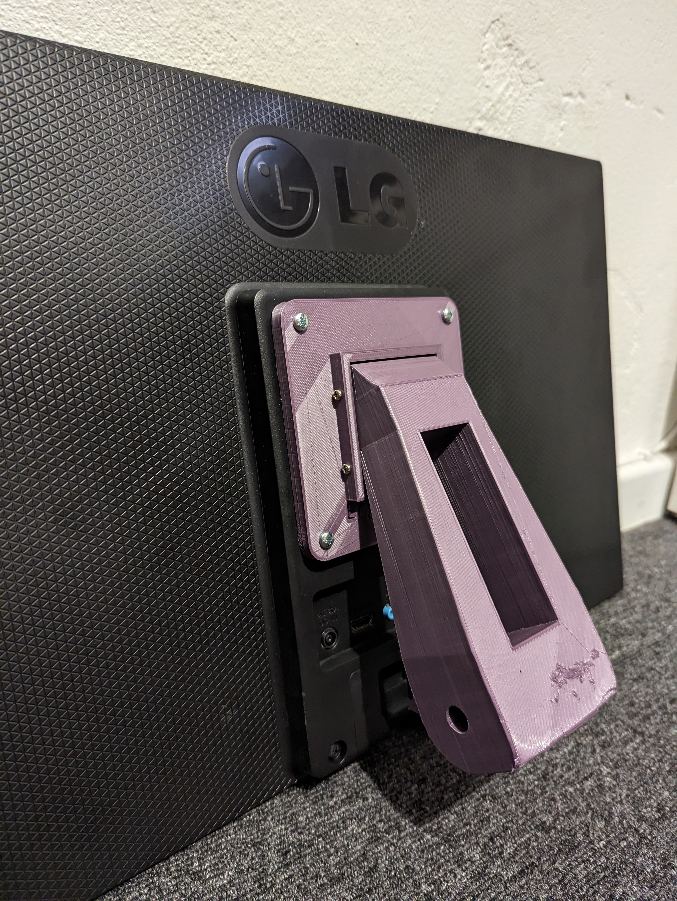

# VESA mount for computer monitor v1

This project replaces the PM5 mounting arm with an arm that allows you to mount a computer monitor (or small TV) using a standard 100x100mm VESA mount.
With this replacement you can then use any input source your monitor/TV supports e.g. Chromecast via HDMI, to watch the content you want
while doing your workout.

I've tested this arm with a 24" LG monitor (pictured) and it supports the weight without issue. A larger monitor may need a longer arm to clear the 
Concept 2 rowing chain, and possibly may also need increased strength. If you're attempting to use a larger monitor please let me know.

Note, that with this project the PM5 is removed completly. It can still be attached to the sensor wire, but if won't be supported in any way. See the
PM5 low mount project for a mounting solution that lets you continue to use the PM5 with the VESA mounted monitor.

